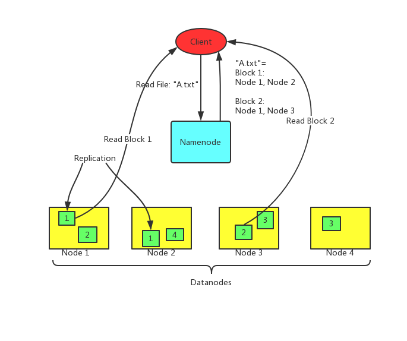

# Computer System Engineering Course Project

## Introduction
Simple Distributed File System (SDFS) is a distributed file system designed for educational purpose. It is a simplified version of [Hadoop Distributed File System (HDFS)](http://hadoop.apache.org/). SDFS loosely follows the structure and style of HDFS, but is largely simplified and lack of usability.

## Assumptions and Goals
SDFS shares some of the assumptions that HDFS is designed upon, including frequent hardware failure and large data sets. But many of these assumptions are only for theoretical consideration. None of them has been tested on real production environment. The goal of this file system is, again, only for educational purpose.

## NameNode and DataNode
Same as HDFS, SDFS also has a master/slave architecture. A SDFS cluster consists of a single *NameNode*, a master server that manages the file system namespace and regulates access to files by *client*s. In addition, there are a number of *DataNode*s, usually one per node in the cluster, which manage storage attached to the nodes that they run on.

SDFS exposes a file system namespace and allows user data to be stored in *file*s. Internally, a file is split into one or more *block*s and these blocks are stored in a set of DataNodes. The NameNode executes file system namespace operations like **opening**, **closing**, and **creating** files and directories. It also determines the mapping of blocks to DataNodes. The DataNodes are responsible for serving **read** and **write** requests from the file system’s clients. The DataNodes also perform block creation, deletion, and replication upon instruction from the NameNode.

## The File System Namespace
SDFS supports a traditional hierarchical file organization. A user or an application can create directories and store files inside these directories. The file system namespace hierarchy is similar to most other existing file systems. It also supports user access permissions. For the sake of simplicity, SDFS does not support moving, removing or renaming the files or directories. It also does not support hard links or soft links.

The NameNode maintains the file system namespace. Any change to the file system namespace or its properties is recorded by the NameNode.

## The Persistence of File System Metadata
The SDFS namespace is stored by the NameNode. It is organized and stored in a way similar to traditional UNIX file system. Both files and directories are represented as `Node`s. `DirNode` consists of a set of entries with each `Entry` representing a subdirectory or a file. `FileNode` contains a list of `BlockInfo`s along with the size of the file. `BlockInfo` stores a list of `LocatedBlock`s with each of them contains the address and ID of a replica of the block. Each `Node` is stored in a file in local host OS file system with the name `[NODE_ID].node`, e.g. `0.node` or `1.node`. ID of the node should be self-increasing positive integer. The root directory should always be identified as `0`. All node files are stored in a single directory.

The NameNode uses a transaction log to persistently record every change that occurs to file system metadata. For example, creating a new file in SDFS causes the NameNode to insert a record into the log indicating this. Similarly, changing the replication factor of a file causes a new record to be inserted into the log. The NameNode uses a file in its local host OS file system to store the log.

The NameNode keeps an image of the entire file system namespace in memory. When the NameNode starts up, or a checkpoint is triggered by a configurable threshold, it reads the file tree and log from disk, applies all the transactions from the log to the in-memory representation of the file tree, and flushes out this new version into a new file tree on disk. It can then truncate the old log because its transactions have been applied to the persistent file tree. This process is called a checkpoint. The purpose of a checkpoint is to make sure that SDFS has a consistent view of the file system metadata by taking a snapshot of the file system metadata and saving it to file tree. Even though it is efficient to read a file tree, it is not efficient to make incremental edits directly to a file tree. Instead of modifying file tree for each edit, we persist the edits in the log. During the checkpoint the changes from log are applied to the file tree. A checkpoint can be triggered at a given time interval expressed in seconds.

The DataNode stores SDFS data in files in its local file system. The DataNode has no knowledge about SDFS files. It stores each block of SDFS data in a separate file in its local file system. All block files are stored in a single directory with the name `[BLOCK_NUMBER].block`.

## The Communication Protocols
All SDFS communication protocols are layered on top of the TCP/IP protocol. A client establishes a connection to a configurable TCP port on the NameNode machine. It talks the `NameNodeProtocol` with the NameNode. A client talks to a DataNode with the `DataNodeProtocol`. The DataNodes talk to the NameNode using the `NameNodeDataNodeProtocol`. A Remote Procedure Call (RPC) abstraction wraps all the communications. By design, the NameNode never initiates any RPCs. Instead, it only responds to RPC requests issued by DataNodes or clients.

## References
[HDFS Architecture](http://hadoop.apache.org/docs/current/hadoop-project-dist/hadoop-hdfs/HdfsDesign.html).

## Credits
SDFS was originally created by [叶政擎](13302010074@fudan.edu.cn) and [傅鹏程](13302010036@fudan.edu.cn) in 2016 during their tenure as the TAs of the Computer System Engineering course instructed by [冯红伟](hwfeng@fudan.edu.cn) at Software School, Fudan University. It was modified and released by [欧承祖](oucz14@fudan.edu.cn) and [袁莉萍](15302010051@fudan.edu.cn) later in 2018.

This document is created by 欧承祖 on Sep. 30, 2018.